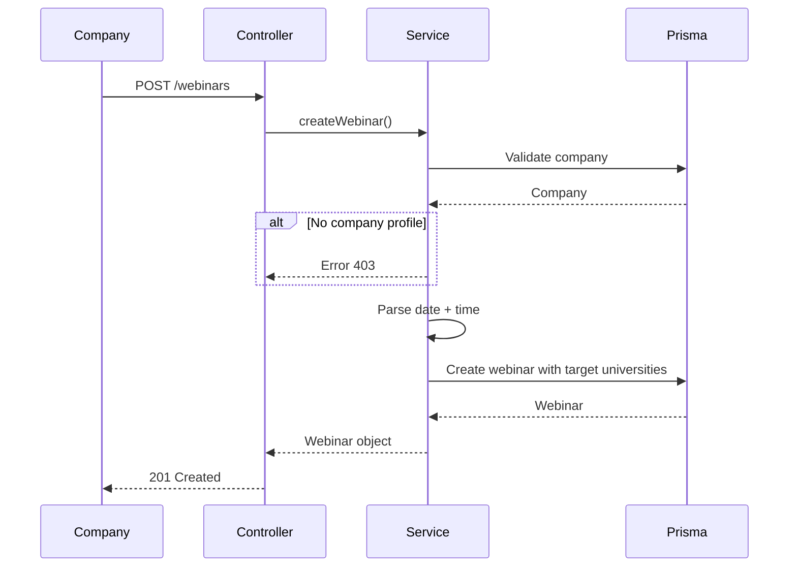
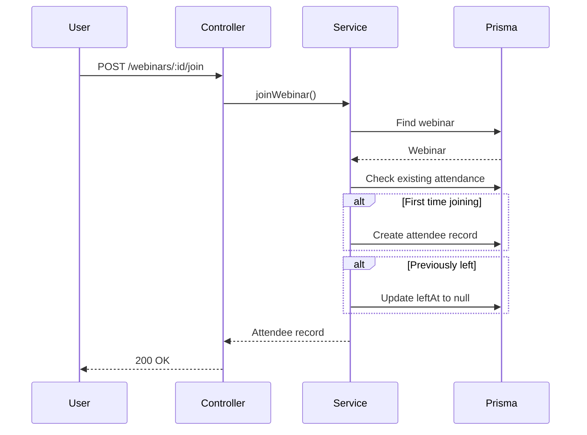

# Webinar Module

## Overview
Virtual seminar/ webinar management system for companies to conduct live sessions with students.

## Features
- Schedule webinars with target universities
- Set duration and meeting links
- Track attendee participation
- Real-time messaging in webinars
- Permission-based speaking control
- Attendee analytics

## Theory & Flow

### Webinar Creation Flow


### Join Webinar Flow


### Permission Management Flow

```mermaid
sequenceDiagram
    participant Host
    participant Controller
    participant Service
    participant Prisma
    
    Host->>Controller: POST /webinars/:id/grant
    Controller->>Service: grantPermission()
    Service->>Prisma: Verify attendee
    Prisma-->>Service: Attendee
    Service->>Prisma: Update hasPermissionToSpeak
    Prisma-->>Service: Updated
    Service-->>Controller: 200 OK
    
    Host->>Controller: POST /webinars/:id/revoke
    Controller->>Service: revokePermission()
    Service->>Prisma: Update permission
    Service-->>Controller: 200 OK
```


## API Endpoints

| Method | Endpoint | Description |
|--------|----------|-------------|
| GET | `/webinars` | List webinars |
| GET | `/webinars/:id` | Get webinar details |
| POST | `/webinars` | Create webinar |
| PATCH | `/webinars/:id` | Update webinar |
| DELETE | `/webinars/:id` | Delete webinar |
| POST | `/webinars/:id/join` | Join webinar |
| POST | `/webinars/:id/leave` | Leave webinar |
| GET | `/webinars/:id/attendees` | List attendees |
| POST | `/webinars/:id/grant` | Grant speaking permission |
| POST | `/webinars/:id/revoke` | Revoke speaking permission |
| GET | `/webinars/:id/messages` | Get chat messages |
| POST | `/webinars/:id/messages` | Send message |

## Attendee Roles
- `VIEWER` - Can only watch
- `SPEAKER` - Can speak (granted by host)
- `HOST` - Can manage permissions

## File Structure

```
webinar/
├── webinar.controller.ts  # HTTP handlers
├── webinar.routes.ts      # Route definitions
├── webinar.schema.ts      # Zod validation schemas
└── webinar.service.ts     # Business logic
```
